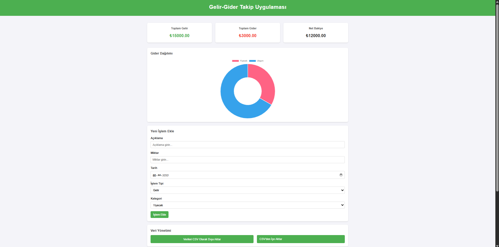
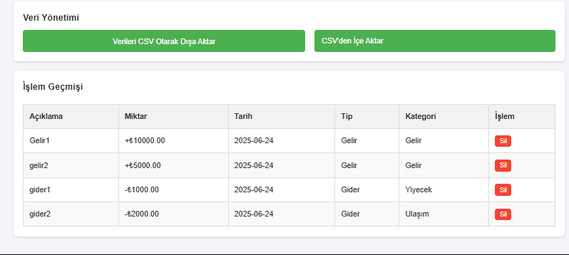

# 💸 Gelir-Gider Takip Uygulaması

Bu web uygulaması, kullanıcıların gelir ve giderlerini kolayca takip edebilmesi için geliştirilmiştir. Uygulama; veri girişleri, kategoriler, toplam hesaplamalar, grafik görselleştirme ve CSV dosya işlemlerini destekler.

## 🚀 Özellikler

- Gelir ve gider ekleme
- Net bakiye, toplam gelir ve toplam gider hesaplama
- Gider kategorilerine göre pasta grafik gösterimi (Chart.js)
- Yeni kategori ekleme
- CSV içe ve dışa aktarım (PapaParse)
- Verilerin `localStorage` ile kaydedilmesi
- Responsive (mobil uyumlu) arayüz

## 🖼️ Uygulama Ekran Görüntüleri

### Anasayfa ve Bakiye Görünümü


### Form Alanı ve İşlem Geçmişi


## 🧪 Teknolojiler

- HTML5 + CSS3
- JavaScript (Vanilla)
- Chart.js – grafik çizimi
- PapaParse – CSV işlemleri

## 📁 Dosya Yapısı

```
📦 gelir-gider-takip
┣ 📂 screenshots
┃ ┣ 📜 ekran1.png
┃ ┗ 📜 ekran2.png
┣ 📜 index.html
┣ 📜 script.js
┣ 📜 styles.css
┗ 📜 README.md
```

## ⚙️ Kurulum

```bash
git clone https://github.com/kullaniciadi/gelir-gider-takip.git
cd gelir-gider-takip
# index.html dosyasını aç ve kullanmaya başla
```

## 👨‍💻 Geliştirici Notu

Bu proje frontend odaklıdır. Backend veya veri tabanı kullanmadan sadece istemci tarafında veri saklar. Kolay kurulum, sade arayüz ve modern kullanıcı deneyimi hedeflenmiştir.

---

**Hazırlayan:** [Adınızı buraya yazın]  
📅 Haziran 2025
